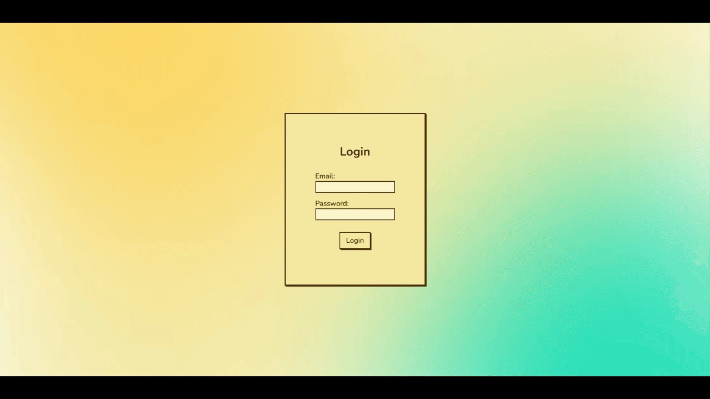
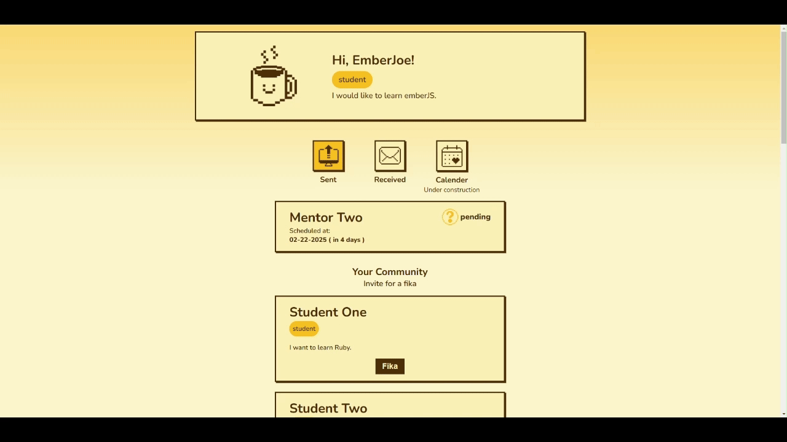

<h3 align="center">Fika Code</h3>

<details>
  <summary>Table of Contents</summary>
  <ol>
    <li>
      <a href="#about-the-project">About The Project</a>
      <ul>
        <li><a href="#built-with">Built With</a></li>
      </ul>
    </li>
    <li><a href="#preview">Preview</a></li>
    <li>
      <a href="#getting-started">Getting Started</a>
      <ul>
        <li><a href="#prerequisites">Prerequisites</a></li>
        <li><a href="#installation">Installation</a></li>
      </ul>
    </li>
    <li><a href="#project-implementation-overview">Project Implementation Overview</a>
     <ul>
        <li><a href="#building-backend-with-rails">Building backend with Rails</a></li>
        <li><a href="#building-frontend-with-emberjs">Building frontend with Ember.js</a></li>
      </ul></li>
    <li><a href="#takeaways-from-the-transaction-railsember-code-challenge">Takeaways from the Transaction Rails/Ember code challenge</a></li>
    <li><a href="#obstacles">Obstacles</a></li>
    <li><a href="#future-improvment">Future Improvment</a></li>
   
  </ol>
</details>

## About The Project

Who hasn’t wished for a mentor while learning to code?
Many turn to online communities to seek help, but sometimes, nothing beats meeting someone face-to-face, sharing knowledge, and growing together over a warm conversation.

That’s where FikaCode comes in. Inspired by the Swedish concept of "Fika"—a delightful tradition of sharing coffee, tea, and sweet treats—this platform is designed to connect coders. It’s a space where mentors and learners can meet, enjoy a fika, and discuss programming.

With such an inviting concept, it’s hard to say no to fika and growth.

### Built With

FikaCode is a full-stack project built with Ruby on Rails for the backend and Ember.js for the frontend.

<a href="https://skillicons.dev">
    
</a>

## Preview

<div align="center">
  
  landing page & sign up
  
  dashboard & sending a fika invitation
  
  sent fika invitation & update received invitaion
</div>

## Getting Started

### Prerequisites

Ensure you have the following installed:

1. Ruby 3.2.0
2. Rails 8.0.1
3. Node v18.20.4
4. SQLite version 3.45.1

### Installation

1. Clone the repo
   ```sh
   git clone
   https://github.com/Yifan-858/fikacode.git
   ```
2. Backend Setup (Rails)
   ```sh
   # navigate to backend folder
   cd backend
   # install dependency
   bundle install
   # set up the test database
   rails db:create db:migrate db:seed
   # run server
   rails server
   ```
3. Frontend Setup (Ember)
   ```sh
   # navigate to backend folder
   cd frontend
   # install dependency
   npm install
   # makesure the apihost URL in your environment.js points to your Rails backend, for exmaple
   ENV.apihost = 'http://localhost:3000'
   # run the server
   ember server
   ```

## Project Implementation Overview

### Building backend with Rails:

1. #### Setting up CORS in Rails:
   Configured CORS in the Rails backend to enable the Ember.js frontend to fetch data from the Rails API running on a different port.
2. #### Creating Models for Fika and User:
   Initially, models were implemented with ActiveModel for lightweight in-memory data storage with Rails cache. However, during the process, it is switched to using Applicationrecord for a persistent database for testing and deploying (SQLite3 & PostgreSQL). After the refactoring, it is easier to validate data with built-in validation methods and error management.
3. #### Creating Controllers for Fika and User:
   Implemented controllers to handle API endpoints for managing Fika invitations and User data. Used strong parameters to handle parameter checking.
4. #### Adding Session Controller
   Implement the login API endpoint where users can authenticate and receive a JWT to access the protected routes. Added credentials.yml and master_key to secure the API secrets.
5. #### Adding authentication middleware:
   To protect the User and Fika data, centralized authentication logic was added in the application_controller to make sure all controllers inherited it. Using before_action in Fika and User controller to call the authentication before access to protected endpoints.
6. #### Testing:
   Added seeds.rd for the database to generate a batch of test users.

### Building frontend with Ember.js:

1. #### Storing the apihost URL in environment.js:
   Avoid hardcoding and to make setup and deployment more flexible. Use ENV to access the URL when making a fetch request to the backend API, for example, in the services.
2. #### Inserting Fika and User models.
3. #### Creating the controllers and routes:
   Using Ember CLI “ember create” to generate the /signup, /login, and /dashboard routes and their associated controllers. Updated the /index route to /landing to make it more readable.
4. #### Signup Controller:
   Validates the user input to avoid unnecessary API requests. After a successful signup, the page redirects the user to the login page to make a smooth user experience
5. #### Login Controller:
   Validates user input before invoking the authentication in the session service.
6. #### Session Service:
   Handels the user login across the whole project and stores the session token in the local storage to provide access to user-specific data.
7. #### Fika and Community Services:
   Handles the API requests to retrieve user-specific fika invitation data and the other users’ information in the community. Storing these methods in services makes it more flexible and reusable to fetch the data across the project.
8. #### Dashboard Route:
   Displays the user’s profile, user-specific fika invitation data, and the other users’ information on the dashboard. Using an async function is inserted with Promise.all to fetch and render all data at the same time, reduce uncécessray delay, and give a smoother user experience.
9. #### UI components:
   Reusable components like community-list, fika-list, fika-button, status-button, and notification are built to make the templates cleaner and more readable. By breaking the UI into smaller parts, it would be easier to maintain and reuse the components throughout the project, even as it grows.

**In summary, the frontend is built with these concepts in mind:**

1. routes: responsible for loading necessary data for rendering the page.
2. controller: manage the user interaction with UI components.
3. service: centralize the API request logic and provide reusable methods throughout the whole project.
4. template: maintain the HTML structure of the application.
5. components: break down reusable UI parts to ensure a maintainable and scalable design.

## Takeaways from the Transaction Rails/Ember code challenge

1. Use before_action callbacks in backend controllers
2. Use ApplicationRecord/ActiveModel built-in validations
3. Use Strong Parameters to handle parameter checking in backend controllers
4. Frontend use controllers, routes,services and components to divide different tasks
5. Extract backend APIhost URL from environment configration in frontend
6. Clean up console.log statement
7. Try to explain WHY and HOW in code description

## Obstacles

1. Didn't get how to use Model with Ember effectively.
2. Struggled with getting UI component updated dynamically, for example, can't update the fika status in real time. As a workaround, the page currently refreshes to display updates.
3. Managed to build and push the Rails backend to Heroku, but struggled to get the database running with PostgresQl.

## Future Improvment

1. Make another try to deploy the backend on Render
2. Make the button UI component reusable
